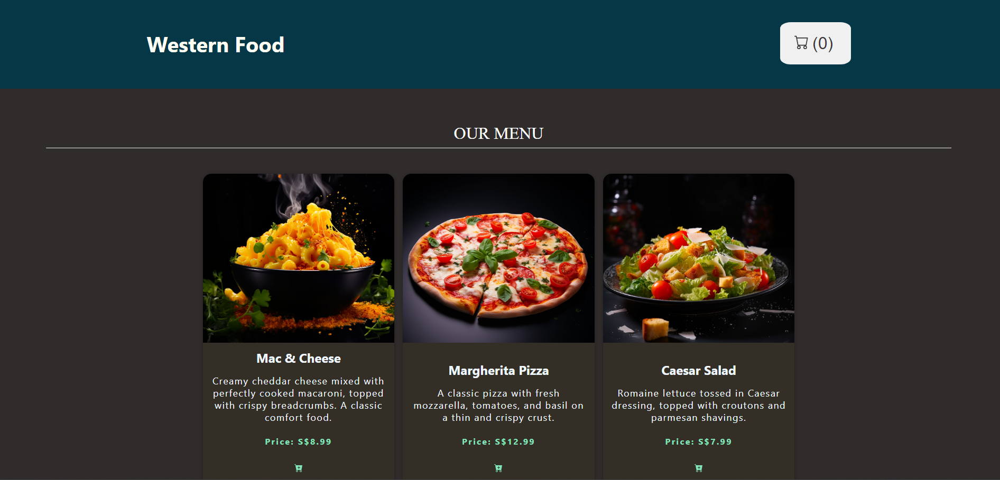
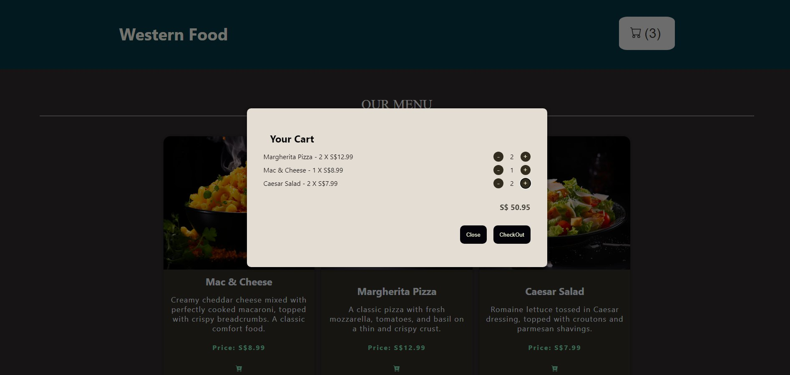
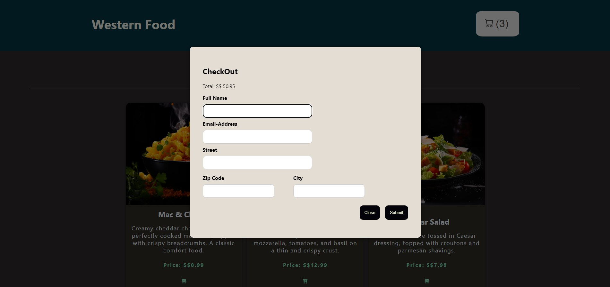
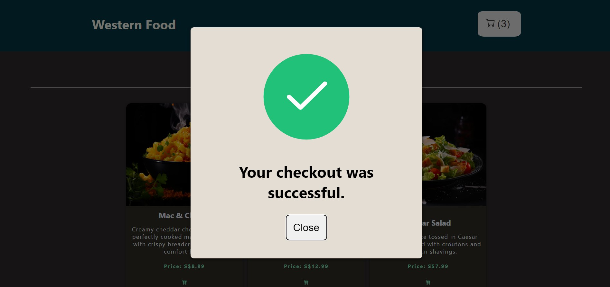

# Online Food Ordering App


<p align="center">
  
</p>

<p align="center">
  
</p>

<p align="center">
  
</p>

<p align="center">
  
</p>


## To run this web applicaton: ##

Firstly, clone this repo, then cd into the project directory:

Then run the following code to launch the front end:  

```
cd client
npm i
npm run dev
```

Paste the link into your browser.  

Open a new terminal.  

Then go back to the project directory and  

```
cd server
```

Now in the backend directory, create a file with the name **.env**  

Inside the **.env** file, key in the following:  

**Note: Replace with your own firebaseConfig**  

```
VITE_FIREBASE_API_KEY=""
VITE_FIREBASE_AUTH_DOMAIN=""
VITE_FIREBASE_PROJECT_ID=""
VITE_FIREBASE_STORAGE_BUCKET=""
VITE_FIREBASE_MESSAGING_SENDER_ID=""
VITE_FIREBASE_APP_ID=""
```


Then in the server directory, run the following:  

```
npm i
npm run dev
```
